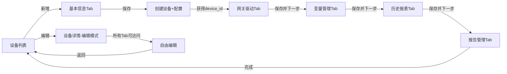

# 设备详情多Tab页面功能实现完成

## ✅ 已完成的工作

### 1. 数据库层
- ✅ 创建5个扩展表：
  - `device_configs` - 设备详细配置
  - `device_drivers` - 网关驱动
  - `device_variables` - 设备变量
  - `device_reports` - 历史报表
  - `device_alarms` - 报告管理
- ✅ 插入测试数据
- ✅ 建立外键关联和级联删除

### 2. 后端实现
- ✅ 扩展模型（`app/models/device.py`）
  - DeviceConfig、DeviceDriver、DeviceVariable、DeviceReport、DeviceAlarm
  - 添加relationship关系
  
- ✅ 创建Schema（`app/schemas/device_detail.py`）
  - 每个模块的Create、Update、Response schema
  - 支持批量操作的Schema
  
- ✅ 实现API（`app/api/v1/device_detail.py`）
  - 设备详细配置：获取、创建、更新（3个接口）
  - 网关驱动：获取列表、创建、更新、删除（4个接口）
  - 设备变量：获取列表、创建、批量创建、更新、批量删除（5个接口）
  - 历史报表：获取列表、创建、更新、删除（4个接口）
  - 报告管理：获取列表、创建、更新、删除（4个接口）
  - **共20个API接口**
  
- ✅ 注册路由到main.py

### 3. 前端实现
- ✅ API封装（`src/api/deviceDetail.js`）
  - 封装所有20个API调用
  
- ✅ 设备详情主容器（`src/views/Admin/DeviceDetail.vue`）
  - Tab切换控制
  - 新增/编辑模式切换
  - 分步完成逻辑（新增模式必须顺序填写）
  
- ✅ 5个Tab组件：
  - `BasicInfo.vue` - 设备基本信息（包含设备基础和扩展配置）
  - `DriversManage.vue` - 网关驱动管理
  - `VariablesManage.vue` - 变量管理（支持批量删除）
  - `ReportsManage.vue` - 历史报表管理
  - `AlarmsManage.vue` - 报告管理
  
- ✅ 修改DeviceList.vue
  - 编辑按钮跳转到设备详情页面
  - 新增按钮跳转到设备详情页面
  
- ✅ 添加路由配置

## 核心功能特性

### 新增模式
1. 点击"新增"按钮 → 进入设备详情页面
2. 只能访问第一个Tab（设备基本信息）
3. 填写完基本信息并保存后：
   - 创建设备记录，获得device_id
   - 保存扩展配置
   - 解锁下一个Tab
4. 按顺序完成所有Tab
5. 最后一个Tab点击"完成"返回列表

### 编辑模式
1. 点击"编辑"按钮 → 进入设备详情页面
2. 所有Tab可自由切换
3. 加载已有数据显示
4. 每个Tab独立保存
5. 支持增删改操作

## 数据流转



## 文件清单

### 后端文件（9个）
1. `sql/create_device_detail_tables.sql` - 数据库表
2. `app/models/device.py` - 模型（已扩展）
3. `app/schemas/device_detail.py` - Schema
4. `app/api/v1/device_detail.py` - API接口
5. `app/main.py` - 路由注册（已更新）
6. `create_device_tables.py` - 建表脚本（已更新）

### 前端文件（9个）
1. `src/api/deviceDetail.js` - API封装
2. `src/views/Admin/DeviceDetail.vue` - 主容器
3. `src/views/Admin/DeviceDetail/BasicInfo.vue` - Tab1
4. `src/views/Admin/DeviceDetail/DriversManage.vue` - Tab2
5. `src/views/Admin/DeviceDetail/VariablesManage.vue` - Tab3
6. `src/views/Admin/DeviceDetail/ReportsManage.vue` - Tab4
7. `src/views/Admin/DeviceDetail/AlarmsManage.vue` - Tab5
8. `src/views/Admin/DeviceList.vue` - 列表页（已更新）
9. `src/router/index.js` - 路由配置（已更新）

## 测试数据

已在数据库中插入测试数据（device_id=1）：
- ✅ 设备基本信息：AMP-119A3
- ✅ 设备扩展配置：1条
- ✅ 网关驱动：1条（Modbus RTU）
- ✅ 设备变量：6条
- ✅ 历史报表：1条（火花探测计数）
- ✅ 报告管理：1条（组态画面）

## 使用说明

### 启动后端
```bash
cd e:\AnPu\anpu-backend
.\venv\Scripts\activate  # 或者你的虚拟环境
uvicorn app.main:app --reload
```

### 启动前端
```bash
cd e:\AnPu\anpu-frontend
npm run serve
```

### 测试流程
1. 登录系统
2. 进入设备管理页面
3. 点击"新增"按钮测试新增流程
4. 点击"编辑"按钮测试编辑流程
5. 验证所有Tab功能正常

## 注意事项

1. **新增模式限制**：必须先完成第一个Tab才能进入后续Tab
2. **数据关联**：所有详情数据通过device_id关联
3. **级联删除**：删除设备会自动删除所有关联的详情数据
4. **批量操作**：变量管理支持批量删除
5. **表单验证**：第一个Tab有必填验证

## 扩展建议

如需进一步完善，可以：
1. 添加图片上传功能（设备图片）
2. 实现地图定位功能
3. 添加数据导入导出
4. 增加更多字段验证
5. 优化UI样式
6. 添加数据权限控制

---

**实现完成！可以开始测试了！** 🎉
